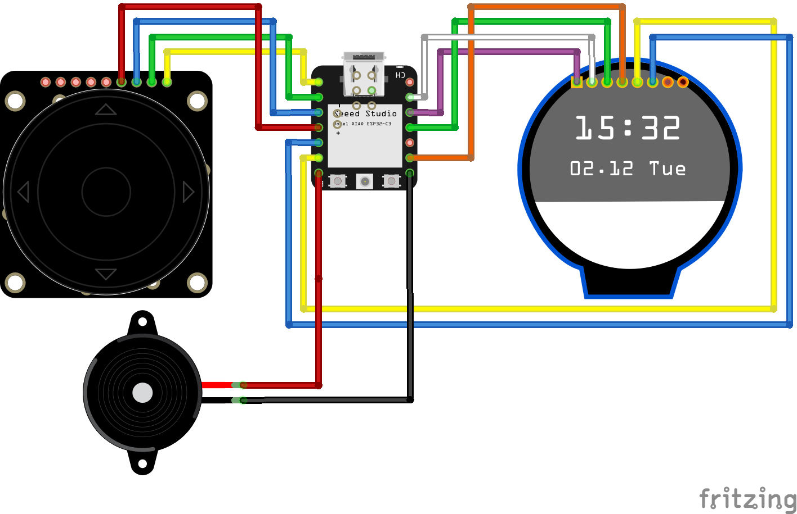

# Galaxis

A tribute to Galaxis, an electronic game from Ravensburger, I loved to play as child.
 This version of the game runs on a ESP32-C3 or ESP32-S3 and makes use of Bluetooth LE to connect two players.

The game is a kind of deductive boardgame like Mastermind for one to two players. The goal of the game is to discover
missing space ships, lost in space. These ships can be found if you enter coordinates into the board computer. Then the
computer answers with the number of ships which can be seen in horizontally, vertically or diagonal in a direct
line. 
Who will find the missing spaceships first?

## Rules

Alarm at headquarters. Four spaceships are missing. By sending out radio signals in the different
directions, how many of the spaceships are seen from a certain point is reported back.

* Player A starts a new game by turning the dial until "New" appears on the display and confirming by pressing the
  middle button to confirm
* Player B joins a game by pressing "Join".
* A yellow ring on the screen indicates the active player
* The player sets a coordinate and presses the middle button.
* The search begins, a radio beam is emitted. Either a number appears on the screen, or a star if one of the ships has
  been found.
    * The number indicates how many of the spaceships can be seen in a horizontal, vertical or diagonal direction. The
      player plugs one of the yellow number pins into the coordinate on the coordinate system.
    * However, it should be noted that spaceships can lie in the radio shadow. This means that spaceships that
      in a direct line behind another spaceship are obscured by the first one and therefore cannot be seen.
      be seen.
      Example: Assume there are two spaceships at points C1 and C4. Then the radio beam from coordinate
      C7 only sees one spaceship (C4). The spaceship C1 is obscured. From position C3, however, two spaceships can be
      seen.
    * The black pins can be used to turn off coordinates where no more spaceships can be anymore.
    * If a spaceship has been found, this is indicated by '*' and the player has another turn
    * If there is a number, it is the next player's turn
    * While the game goes further, the players draw their conclusions from the coordinates entered and continue searching at the intersections.
* The first player to find all four spaceships wins the game.
* Press the middle button to start a new game.

Translated with www.DeepL.com/Translator (free version)

[The original rules from 1980 (in german language)](https://www.ravensburger.de/spielanleitungen/ecm/Spielanleitungen/Galaxis_Electronic.pdf)

## Build

The build-process requires an installation
of [PlatformIO Core CLI](https://docs.platformio.org/en/stable/core/index.html#piocore), or your favorite IDE with a
PlatformIO extension.

In case of PlatformIO Core CLI, please follow these instructions:

* `git clone https://github.com/jrmrtns/galaxis.git`
* `cd ./galaxis/Galaxis`
* Connect a Seeed XIAO ESP323 with a USB-C cable to your computer
* `pio run -e seeed_xiao_esp32c3 --target upload`

## Schematic

## BOM

* [Display Waveshare 1.28 Round](https://www.berrybase.de/en/1.28-240x240-rundes-lcd-display-modul-65k-rgb-spi-interface?c=2384
  )

* [Seeed XIAO ESP32-C3](https://www.berrybase.de/en/seeed-xiao-esp32c3-winziges-mcu-board-mit-wlan-und-ble
  ) or [Seeed XIAO ESP32-S3](https://www.seeedstudio.com/XIAO-ESP32S3-p-5627.html)

* [Adafruit ANO Rotary Encoder](https://www.berrybase.de/en/adafruit-ano-scrollrad-drehgeber
  )

* [PCB for Adafruit ANO Rotary Encoder](https://www.berrybase.de/en/adafruit-breakout-pcb-fuer-ano-scrollrad-drehgeber)

## 3D Files

Even if there is a single player version, I recommend to print the deck twice. To assemble one deck, you need to print
all the following parts:

* 1 x [Bottom of the case](./3d/Boden.stl)
* 1 x [Lid of the case](./3d/Deckel.stl)
* 1 x [Inlay for the case](./3d/Inlay.stl)
* 1 x [Plate for the display](./3d/Display.stl)
* 1 x [Plate for the pins](./3d/Platte.stl)
* 50 x [Black Pins](./3d/BlackPin.stl)
* 5 x [Pin 0](./3d/Pin-0.stl)
* 10 x [Pin 1](./3d/Pin-1.stl)
* 10 x [Pin 2](./3d/Pin-2.stl)
* 10 x [Pin 3](./3d/Pin-3.stl)
* 5 x [Pin 4](./3d/Pin-4.stl)
* 4 x Pins with Spaceships (coming soon, in the meanwhile I use the black pins printed with white filament)

## Assembly

### Step 1

Prepare some cables. This is optional, you can soltder cables directly to the board. If you have a possibility to crimp
some conectors to cables, its getting easier to assemble. Otherwise you can
use [Dupont Cables](https://www.berrybase.de/40pin-jumper/dupont-kabel-male-female-trennbar) and remove one end.

### Step 2

Solder the cable in the middle (from step 1 above) to the rotatry encoder

### Step 3

Place the cable between the gap of the bottom side of Inlay.stl.

### Step 4

Insert the inlay into the bottom of the case.

### Step 5

Solder the remaining two cables directly to the pads of the board.

### Step 6

Let the board snap into the case.

### Step 7

Connect the display and snap the display into Display.stl

### Step 8

Build and upload the software to the chip, snap the Display.stl into the case and connect power to USB-C

## Paperware

If you do not have access to a 3d printer, or while your printer is working (and mine was working for quite a long
time), there is a
[pdf to print out a board](./assets/sheet.pdf). With this sheet, Galaxis can be played using paper and pencil.

## Credits

* [Internet connection icons created by Erix - Flaticon](https://www.flaticon.com/free-icons/internet-connection)

* [Lumina Obscura](https://pixabay.com/users/luminas_art-4128746/?utm_source=link-attribution&utm_medium=referral&utm_campaign=image&utm_content=3608029)

* [Font DestructoBeam BB Regular](https://fontsgeek.com/fonts/DestructoBeam-BB-Regular)